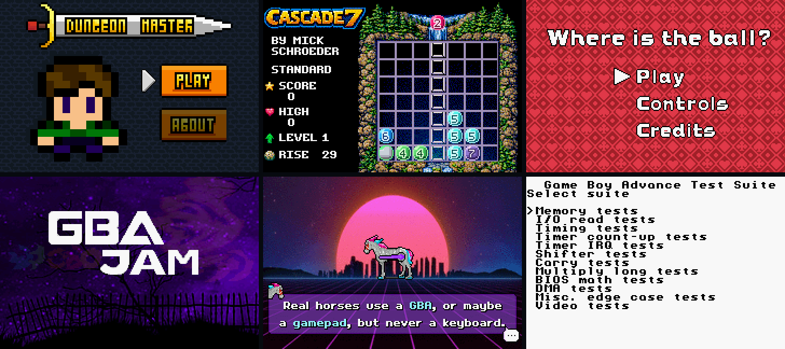

# rgba

[](https://github.com/bokuweb/rgba/actions/workflows/rust.yml)
[](https://github.com/bokuweb/rgba/actions/workflows/pages.yml)

A Game Boy Advance emulator written in Rust. One core, two frontends:

* **native** — an SDL2 window (`cargo run -- rom.gba`)
* **web** — a WASM build wrapped in a No$gba-style debugger, with a built-in
  library of open-source homebrew ROMs

**▶ Try it in the browser: https://bokuweb.github.io/rgba/**

[](https://bokuweb.github.io/rgba/)

<sub>Dungeon Master · CASCADE7 · Where is the ball? · GBA Microjam '23 · BeatBeast · mGBA test suite — all rendered by rgba.</sub>

## Contents

- [Web debugger](#web-debugger)
- [Native frontend](#native-frontend)
- [Emulation status](#emulation-status)
- [Architecture](#architecture)
- [Development](#development)
- [ROM library & licenses](#rom-library--licenses)
- [References](#references)

## Web debugger

The hosted build at https://bokuweb.github.io/rgba/ is deployed from `main`
by [`pages.yml`](.github/workflows/pages.yml). It runs the emulator core as
WebAssembly and adds an inspection UI around it:

| Panel | What you can do |
|-------|-----------------|
| Toolbar | run / pause / single-step / reset, live **PC**, CPU mode (ARM/THUMB), cycle counter, audio toggle |
| ROM library | pick from bundled open-source ROMs (see [below](#rom-library--licenses)) or load any `.gba` file; `?rom=<id>` deep-links an entry |
| Disassembly | follows the PC; click a line to toggle a **breakpoint** (run stops on hit) |
| Screen | 240×160 canvas, current video mode, FPS, per-layer **isolate** toggles for BG0–3 / OBJ |
| Registers / CPSR | r0–r15 (changed registers flash), N Z C V flags, mode bits |
| Memory | hex + ASCII dump, goto address, follow SP, inline byte editing |
| Assembler | type ARM asm, assemble into memory, optionally set PC and run |
| Audio scope | L/R oscilloscope of the APU output (AudioWorklet playback) |

Keys: `Z`=A `X`=B `Enter`=Start `Space`=Select arrows=D-Pad `A`=L `S`=R.

Details of the JS ↔ WASM surface are in [`web/README.md`](web/README.md).

### Running the web build locally

```bash
rustup target add wasm32-unknown-unknown
cargo install wasm-pack
```

```bash
wasm-pack build --target web --out-dir web/pkg --no-typescript --release
```

```bash
python3 web/fetch-roms.py   # optional: populate the ROM library (web/roms/)
```

```bash
node web/static-server.js   # then open http://localhost:8761/web/
```

## Native frontend

Requirements: Rust stable and SDL2.

```bash
brew install sdl2
```

On Apple Silicon add this to your shell profile so the linker can find SDL2:

```bash
export LIBRARY_PATH="$LIBRARY_PATH:$(brew --prefix)/lib"
```

```bash
cargo run --release -- ./fixtures/hello/hello.gba
```

* Save data is written to `<rom>.sav` next to the ROM.
* Logging goes through `tracing`; `RUST_LOG=info` / `debug` raises the level
  (default `warn`).
* Same key map as the web build, plus `Esc` to quit.

## Emulation status

| Area | Status |
|------|--------|
| CPU | ARM7TDMI — full ARM + THUMB instruction sets, all processor modes, IRQ, SWI, pipeline-accurate PC semantics, wait-state cycle table per memory region |
| BIOS | `bios/bios.bin` is embedded at compile time and mapped at `0x0000_0000`; SWI system calls are implemented in HLE (`src/cpu/bios.rs`) |
| Video | Modes 0–5, BG0–3 (text / affine), OBJ (incl. affine), windows, alpha blending, mosaic |
| Audio | 4 PSG channels (square×2 with sweep/envelope, wave, noise) + 2 DirectSound FIFOs fed by DMA / timers, resampled to 32 768 Hz |
| DMA / Timers | DMA0–3 (immediate / VBlank / HBlank / FIFO), Timer0–3 with count-up cascading |
| Backup | SRAM / Flash / EEPROM autodetected from the ROM's SDK marker |
| GamePak | GPIO + S-3511A real-time clock (Pokémon RSE, Boktai style carts) |
| Input | KEYINPUT / KEYCNT registers (keypad IRQ not yet implemented) |
| Debugger | Single-step, breakpoints, disassembler (bin→asm), two-pass assembler (asm→bin, labels) |

Verified with [jsmolka/gba-tests](https://github.com/jsmolka/gba-tests) (ARM /
THUMB / memory / BIOS), the [mGBA test suite](https://github.com/mgba-emu/suite),
armwrestler and the homebrew titles in the ROM library. Compatibility is still
a work in progress — some engines (e.g. BPCore/Lua, some Butano titles) don't
boot yet.

## Architecture

```
src/
  main.rs        native SDL2 frontend (binary)
  lib.rs         library root used by the WASM build
  wasm.rs        wasm-bindgen shim (`GbaHandle`)
  gba/           system glue: bus + wait states, DMA, timers, APU, backup memory, RTC
  cpu/           ARM7TDMI: decoder, instructions, registers, asm/disasm, HLE BIOS
  lcd/           PPU: DISPCNT/BGCNT/DISPSTAT registers and the scanline renderer
  io/            keypad
  interrupt/     IE / IF / IME
  memory/        RAM / ROM primitives
web/             browser debugger (index.html, app.js, AudioWorklet, roms.json)
bios/            GBA BIOS image (included at compile time)
fixtures/        test ROMs and their sources
docs/            README assets
```

The binary (`src/main.rs`) and the library (`src/lib.rs`) compile the same
module tree independently; SDL2 is gated to non-wasm targets so
`wasm-pack build` only pulls in `wasm-bindgen`. The core exposes a small
debugger surface (`GBA::step_instruction`, `run_frame_or_break`, breakpoints,
`read_memory`, …) that both the web UI and the tests use.

## Development

```bash
cargo test
```

```bash
cargo clippy --all-targets
```

Clippy runs with `all` + `pedantic` denied (see `[workspace.lints]` in
`Cargo.toml`), so any new lint finding fails CI.

Unit tests live next to the code (`#[cfg(test)]` modules per instruction /
device). The end-to-end tests in `src/gba/mod.rs` embed `fixtures/hello/hello.gba`
and `fixtures/dot_rs/dot.gba` and check the rendered frame. There is also an
ignored frame-capture harness for eyeballing any ROM headlessly:

```bash
ROM=web/roms/dungeon-master.gba FRAMES=600 cargo test --release --lib capture_beat_beast -- --ignored
```

(frames land in `target/bb/*.bmp`). The C / Rust fixtures can be rebuilt with
`cd fixtures && make`, which uses Docker (`shumon84/gba` and `bokuweb/rust-gba`
from the root `Dockerfile`).

## ROM library & licenses

The web debugger ships a small library of **open-source** ROMs so there is
something to run without hunting for files. They are not committed to this
repository; the Pages build downloads each one from its author's GitHub release
and verifies a pinned sha256 (see [`web/roms.json`](web/roms.json) and
[`web/fetch-roms.py`](web/fetch-roms.py)).

| ROM | Author | Event | License |
|-----|--------|-------|---------|
| [Dungeon Master](https://github.com/Maksasj/dungeon_master) | Maksasj | GBA Jam 2022 | MIT |
| [CASCADE7](https://github.com/mick-schroeder/gba-cascade7) | Mick Schroeder | — | MIT (name/logo trademarked) |
| [Where is the ball?](https://github.com/johedan20012/WhereIsTheBall) | johedan20012 | GBA Jam 2021 | MIT |
| [GBA Microjam '23](https://github.com/gbadev-org/microjam23) | gbadev community | Microjam 2023 | MIT (per-asset credits in release) |
| [BeatBeast](https://github.com/afska/beat-beast) | afska et al. | GBA Jam 2024 | MIT code, CC BY-NC 4.0 audio |
| [gba-tests](https://github.com/jsmolka/gba-tests) arm / thumb / memory / bios | jsmolka | — | MIT |
| [mGBA test suite](https://github.com/mgba-emu/suite) | endrift | — | MIT |
| hello, lifegame | bokuweb | — | this repository |

Thanks to all of the authors for publishing their work. If you'd like a ROM
removed or the attribution corrected, please open an issue.

## References

* [GBATEK](https://problemkaputt.de/gbatek.htm) — the hardware reference
* [gbadev.net](https://gbadev.net/) / [Homebrew Hub](https://hh.gbdev.io/) — homebrew community & ROM database
* [jsmolka/gba-tests](https://github.com/jsmolka/gba-tests), [mGBA suite](https://github.com/mgba-emu/suite) — accuracy tests
* [GBA test ROM index](https://emulation.gametechwiki.com/index.php?title=GBA_Tests)
